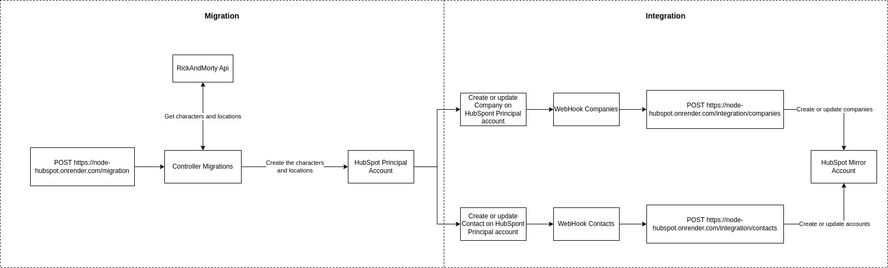

# API Usage Instructions

Welcome to the API documentation for the Node-HubSpot integration. This API provides functionality for migrating data from an external API (RyckAndMorty)and the integration of webhooks in HutSpot for contacts and companies.

## Configuration

Set the following environment variables on your deployment instance:

```bash
ACCESS_TOKEN='principal_hubspot_access_token'
ACCESS_TOKEN_MIRROR='mirror_hubspot_access_token'
TOTAL_CHARACTERS='total characters to check on the rick and morty api'
```

### 1. Migrate Prime Character and Related Locations

#### Endpoint: `POST /migrations`

**Description:**
This endpoint generates the complete migration of the prime `id` charactes and its related locations from the external [API RyckAndMorty](https://rickandmortyapi.com/documentation/#rest) to the principal account.

**Usage:**

```bash
curl -X POST https://node-hubspot.onrender.com/migrations
```

### 2. Integration with HutSpot

#### Endpoint: `POST /integration/contacts`

**Description:**
This endpoint has the logic to integrate the webhook in HutSpot in the source account to create and update contacts on the mirror account. The url in the webhook
of hotSpot is `POST https://node-hubspot.onrender.com/integration/contacts`.

#### Endpoint: `POST /integration/companies`

**Description:**
This endpoint has the logic to integrate the webhook in HutSpot in the source account to create and update companies on the mirror account. The url in the webhook of hotSpot is `POST https://node-hubspot.onrender.com/integration/companies`.

## Deployment Information

This API is deployed on the [Render platform](https://render.com/).

### Base URL: `https://node-hubspot.onrender.com`

Feel free to reach out if you have any questions or encounter issues.

### Diagram


